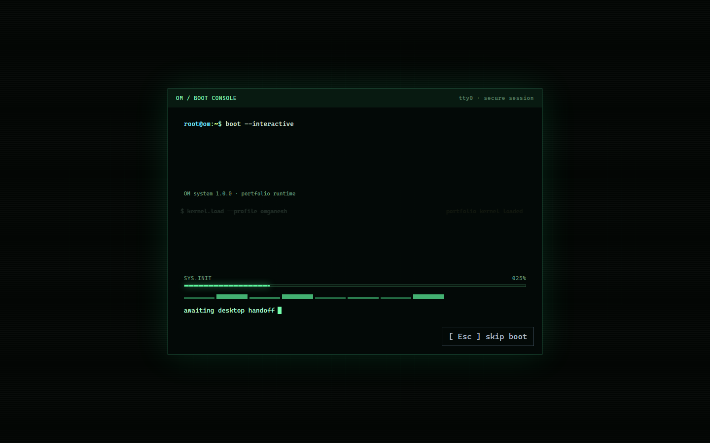
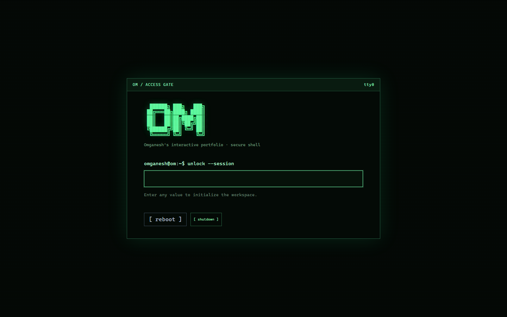

# OM — Terminal-Based Portfolio

OM is OmGanesh R Matiwade’s interactive developer portfolio. It uses a terminal-native operating-system theme while keeping every portfolio section accessible from the main workspace—no terminal commands required.

[GitHub repository](https://github.com/Omganesh014/Terminal-Based-Portfolio) · [GitHub profile](https://github.com/Omganesh014)

## Screenshots

| Boot console | Access gate |
| --- | --- |
|  |  |

## Features

- Animated terminal boot sequence, access gate, logout, sign-out, shutdown, and reboot flows.
- Keyboard-accessible main workspace with direct navigation to Profile, Resume, Projects, Experience, Education, Skills, Certificates, Achievements, and Contact.
- Clickable project browser with complete summaries, problems solved, tech stacks, features, roles, achievements, repository links, and the SpendDay demo video.
- Responsive mobile layout for the workspace, dialogs, project pages, contact links, and long project details.
- Downloadable resume from the Resume section.
- Terminal-style social links for Instagram, GitHub, LinkedIn, and email.
- Optional xterm.js shell with command history, case-insensitive portfolio paths, filesystem navigation, pipes, redirects, and command chaining.
- Store-backed virtual filesystem and local portfolio content.
- 4 distinct visual themes (midnight, ember, aurora, neon) applied consistently across desktop UI and terminal.

## Plan Vs Execution

The original execution plan lives in [docs/OMOS_EXECUTION_PLAN.md](docs/OMOS_EXECUTION_PLAN.md). This table tracks how the shipped work compares to that roadmap.

| Original plan | Execution status | Notes |
| --- | --- | --- |
| Phase 0 - Foundation | Complete | Repo setup, state stores, xterm.js terminal, and validation are in place. |
| Phase 1 - Core OS | Complete | Boot flow, virtual filesystem, shell parsing, piping, redirects, and chaining are implemented. |
| Phase 1.5 - Portfolio Ready | Complete | Real portfolio content, resume download, live GitHub integration, a contact form, architecture-view, and four polished themes (midnight, ember, aurora, neon) are implemented. |
| Phase 2 - Recruiter Edition | Complete | Guided recruiter mode with role-based highlighting and a 3-minute path are shipped. |
| Phase 3 - AI Edition | Not started | Portfolio-scoped assistant and safety controls are not yet built. |
| Phase 4 - Optional Advanced OM | Not started | Plugin, package manager, SQL, network, and game simulations remain future work. |

### What is already shipped beyond the original baseline

- Resume content is extracted into the UI and is downloadable from the Resume section.
- About me copy is added as a dedicated portfolio section.
- Copy-email support is available in Contact.
- Analytics are gated so they only load after deployment.
- Playwright coverage exists for login, project navigation, fullscreen, and shutdown behavior.

### Delivered upgrades versus the original plan

- Live GitHub/profile integrations are implemented with caching and fallback (replacing the originally planned always-live approach).
- Themed variants expanded to 4 polished variants (midnight, ember, aurora, neon).
- Recruiter mode is implemented via guided recruiter flow with role-based highlighting and validated.
- AI assistant and advanced simulations remain roadmap items.


## Tech stack

React 19, TypeScript, Vite, Zustand, xterm.js, Tailwind CSS, Vitest, ESLint, Prettier, Docker, and nginx.

## Run locally

Prerequisites: Node.js 20+ and npm.

```bash
git clone https://github.com/Omganesh014/Terminal-Based-Portfolio.git
cd Terminal-Based-Portfolio/frontend
npm install
npm run dev
```

Open `http://localhost:5173`.

### Quality checks

```bash
npm run test
npm run lint
npm run build
```

### Docker

```bash
docker compose up --build
```

Open `http://localhost:8080` after the container starts.

## Project structure

```text
frontend/   # Vite React application, workspace UI, terminal runtime, and stores
backend/    # Reserved for future API/proxy services
docs/       # Project plans, progress log, and README screenshots
```

## License

Licensed under the [MIT License](LICENSE).
